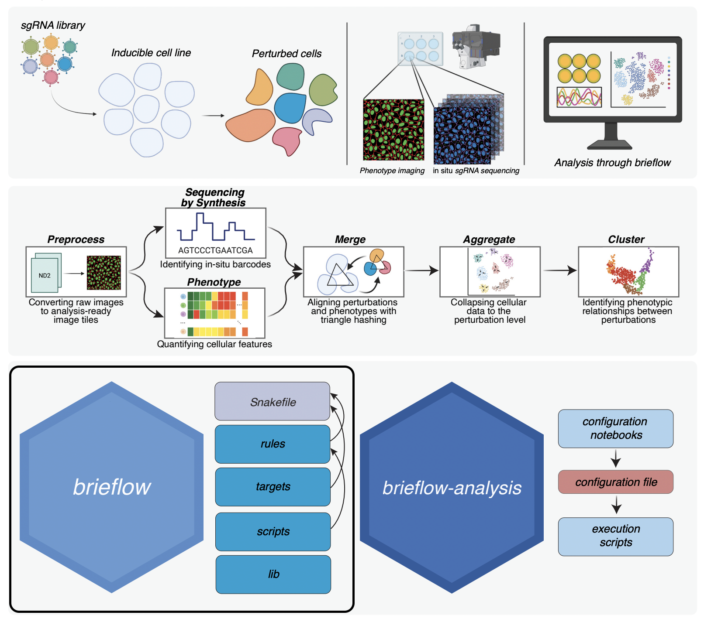

# Brieflow

[](https://github.com/cheeseman-lab/brieflow/releases)
[](https://www.python.org/downloads/)
[](https://brieflow.readthedocs.io)
[](https://github.com/cheeseman-lab/brieflow/actions/workflows/test_analysis.yml)
[](https://discord.gg/yrEh6GP8JJ)
[](LICENSE)
[](https://doi.org/10.1101/2025.05.26.656231)



Brieflow is an extensible computational pipeline for high-throughput analysis of optical pooled screening data.

This repo contains the source code for running an OPS screen analysis.
[Brieflow Analysis](https://github.com/cheeseman-lab/brieflow-analysis) contains configuration notebooks/files and execution scripts for running an OPS screen analysis.

## Getting Started

We strongly suggest that Brieflow is set up with the companion [Brieflow Analysis](https://github.com/cheeseman-lab/brieflow-analysis) repository.

Full details on setup, installation, test data, usage, module details, and contribution guides:  
**https://brieflow.readthedocs.io**

## Citing Brieflow

Brieflow was created by [Matteo Di Bernardo](https://github.com/mat10d), [Roshan Kern](https://github.com/roshankern), and others in the [Cheeseman Lab](https://cheesemanlab.wi.mit.edu/).
Brieflow was started in 2024 and is actively being developed.
If you are interested in contributing please reach out!

If you use our code please cite this manuscript:

```
@ARTICLE
author={Di Bernardo, Matteo and Kern, Roshan S. and Mallar, Alexa and Nutter-Upham, Andy and Blainey, Paul C. and Cheeseman, Iain},
title={Brieflow: An Integrated Computational Pipeline for High-Throughput Analysis of Optical Pooled Screening Data},
year={2025},
DOI={10.1101/2025.05.26.656231}
```

## Contributing

We welcome community contributions to Brieflow. Optical pooled screens vary between labs and we would love to add and share approaches that you have taken to your data such that the community can make use of this!

Feel free to:
- Giving the repo star to boost Brieflow's visibility!
- Join Brieflow's [Discord](https://discord.gg/yrEh6GP8JJ) to chat with the developers.
- File a [GitHub issue](https://github.com/cheeseman-lab/brieflow/issues) to share comments and issues.
- Clone the repository, create a new branch, and submit a [pull request](https://github.com/cheeseman-lab/brieflow/compare) as detailed in the [pull request template](.github/pull_request_template.md).

Make sure to review the Brieflow [development guide](https://brieflow.readthedocs.io/en/latest/4.development.html) to understand how to best contribute!

